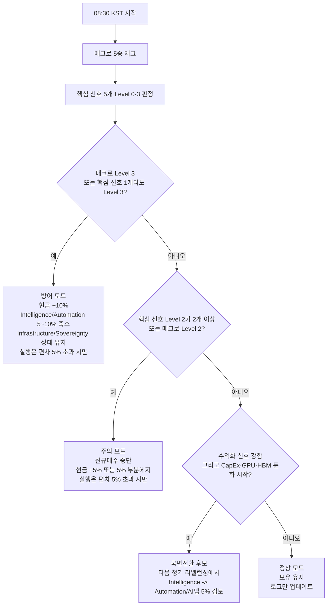

# 08시 30분 병목 포트 모니터링 체크리스트

## 요약

당신의 포트는 “AI 종목”보다 **경제 시스템의 병목**에 투자하는 구조이므로, 매일 08:30 KST에 확인할 핵심은 “기술 뉴스”가 아니라 **병목의 가격결정력과 자본 유입이 유지되는가, 둔화되는가, 다른 병목으로 이동하는가**입니다. 지금 국면에서 가장 유효한 5개 코어 신호는 **Hyperscaler AI CapEx, NVIDIA GPU 수요, HBM 수급/가격, 전력·그리드 제약, AI 수익화/기업 도입**입니다. 이 5개는 각각 **돈이 어디에 들어가고 있는지, 어떤 병목이 실제로 프리미엄을 받고 있는지, 그리고 포트의 다음 회전축이 어디인지**를 보여줍니다. Microsoft는 FY26 Q3에 AI 사업 연간 매출 런레이트 370억달러를 공개했고, Alphabet은 2026년 Q1 CapEx 357억달러와 2027년의 의미 있는 증가를, Meta는 2026년 CapEx 가이던스를 1,250억~1,450억달러로 상향했으며, Amazon은 2025년 현금 CapEx 1,283억달러에 이어 2026년 증가를 예상하고 있습니다. NVIDIA는 FY2026 Q4 데이터센터 매출 623억달러를 기록했고, Google·Micron·PJM·EIA·CBRE 자료는 여전히 **컴퓨트·메모리·전력** 병목이 핵심임을 보여줍니다. citeturn31view0turn31view2turn32view0turn31view3turn30view0turn7search1turn8search2turn18search14turn17search0turn18search16

08:30 루틴의 목적은 예측이 아니라 **분류**입니다. 전일 미국장 종료 기준으로 공식 10년물 금리와 시장 가격을 읽고, 야간에 나온 IR/실적/가이던스를 체크한 뒤, 5개 신호와 매크로 패널을 각각 **Level 0–3**으로 태깅하면 됩니다. 미국 재무부의 일일 수익률은 뉴욕 연은이 약 오후 3:30 ET에 수집한 종가성 호가를 기반으로 하며, CME FedWatch는 30일 연방기금선물 가격으로 금리변경 확률을 계산하므로, 한국시간 아침에는 전일 미국장과 야간 이벤트를 거의 모두 반영해 볼 수 있습니다. CPI와 PCE는 각각 BLS와 BEA가 월별로 08:30 ET에 발표하므로, **발표 당일 밤**에 움직인 시장 반응을 **다음날 08:30 KST 루틴**에 반영하는 구조가 가장 깔끔합니다. citeturn0search4turn0search1turn27search0turn28search0

매매 원칙은 단순해야 합니다. **Level 0은 보유**, **Level 1은 신규추가 중단**, **Level 2는 현금 5% 확보 또는 5% 부분헤지**, **Level 3은 현금 10% 방어와 민감 슬롯 5~10% 축소**가 기본입니다. 다만 실제 **슬롯 리밸런싱은 목표 비중 대비 현재 비중의 차이가 5%를 넘을 때만** 실행하세요. 그 미만은 거래하지 말고, 관찰·기록·현금 유지로 대응하는 편이 ISA 구조에 더 유리합니다.

| Level | 해석 | 08:30 행동 |
|---|---|---|
| 0 | 병목 유지·확장 | 보유, 조정 시만 현금 분할투입 |
| 1 | 둔화 조짐 | 보유, 해당 슬롯 신규매수 중단 |
| 2 | 구조적 경고 | 현금 +5% 또는 5% 부분헤지, **목표 변경치가 5% 초과 시에만** 리밸런스 |
| 3 | 국면 훼손 | 현금 +10%, 민감 슬롯 5~10% 축소 또는 방어 슬롯/현금으로 이동 |

## 핵심 신호와 포트 영향

아래 표는 5개 신호를 “어느 슬롯에 가장 먼저 반응하는가” 기준으로 압축한 것입니다. 이 영향도는 Microsoft·Alphabet·Meta·Amazon·NVIDIA·Micron·PJM·EIA·CBRE·Palantir 자료를 바탕으로 정리한 것입니다. citeturn31view0turn31view2turn32view0turn31view3turn30view0turn7search1turn8search2turn18search14turn17search0turn20search1

| 신호 | 포트 영향 |
|---|---|
| Hyperscaler AI CapEx | **Intelligence 최우선**, Infrastructure 2순위. CapEx 둔화는 AI 반도체와 데이터센터 체인의 멀티플 압축 신호 |
| NVIDIA GPU 수요 | **Intelligence 직격탄**, Infrastructure 간접. GPU 수요가 둔화되면 반도체·ASIC·서버 밸류체인이 동시에 약화 |
| HBM 수급/가격 | **Intelligence 핵심**, 국내 반도체 비중(KODEX 반도체 등)에 직접 영향. 메모리 병목이 풀리면 AI 프리미엄 약화 |
| 전력·그리드·냉각 제약 | **Infrastructure 최우선**, Intelligence/Automation은 간접. 전력 제약 유지 시 인프라 슬롯의 구조적 우위 지속 |
| AI 수익화·기업 도입 | **Automation 전환 신호**, Intelligence와 Infrastructure의 “다음 회전축” 판단. 인프라에서 앱/에이전트/소프트웨어로 이동 여부 결정 |

## 일일 코어 신호

아래 5개만 매일 보세요. 중요한 것은 숫자를 많이 보는 것이 아니라 **전일 대비 변화**와 **문구의 톤 변화**입니다.

**Hyperscaler AI CapEx**

읽을 데이터는 Microsoft의 **capital expenditures / cash paid for PP&E / AI business annual revenue run rate / Azure·Cloud 성장**, Alphabet의 **CapEx / technical infrastructure mix / Cloud backlog / 2027 CapEx 코멘트**, Meta의 **full-year capital expenditures guidance**, Amazon의 **cash capital expenditures / technology infrastructure / AWS support**입니다. 현재 Microsoft는 FY26 Q3에서 CapEx 319억달러와 AI 사업 연간 런레이트 370억달러를 공개했고, Alphabet은 2026년 Q1 CapEx 357억달러와 기술 인프라 비중(서버 60%, 데이터센터·네트워크 40%), 2026년 CapEx 가이던스 1,800억~1,900억달러, 2027년의 유의미한 증가를 언급했습니다. Meta는 2026년 CapEx 가이던스를 1,250억~1,450억달러로 올렸고, Amazon은 2025년 현금 CapEx 1,283억달러와 2026년 증가 전망을 밝혔습니다. 소스는 각사 IR·컨콜·SEC 10-K/10-Q가 1순위입니다. citeturn31view0turn31view2turn32view0turn31view3turn30view0

이 신호가 중요한 이유는 **돈이 병목으로 들어오는 속도**를 가장 직접적으로 보여주기 때문입니다. Intelligence는 이 지표에 가장 민감하고, Infrastructure는 2차 수혜입니다. Automation은 지연반응이고, Sovereignty는 직접 영향이 가장 작습니다.

트리거는 이렇게 보세요. **Level 0**은 4개사 중 3개 이상이 가이던스를 유지·상향하고, “capacity 확대” “AI demand 강세” 문구가 반복될 때입니다. **Level 1**은 한두 회사가 “efficiency / optimization / pacing”을 말하지만 가이던스는 유지할 때입니다. **Level 2**는 2개 이상이 CapEx 가이던스를 사실상 낮추거나 데이터센터 건설 지연·취소를 언급할 때입니다. **Level 3**은 그룹 CapEx가 전년 대비 평탄화·감소하고, 여러 회사가 동시에 투자 속도 조절을 공언할 때입니다.

08:30 조치는 Intelligence가 대상입니다. L0는 보유, L1은 Intelligence 신규추가 중단, L2는 현금 +5% 또는 Intelligence 5% 부분헤지, L3는 Intelligence 5~10% 방어 축소입니다. 단, 실제 매도·리밸런싱은 **현재 비중과 목표 비중 차이가 5%를 넘을 때만** 합니다.

빈도는 **분기 중심**, 지연은 **실적 발표 직후~다음날 아침 반영**입니다.  
로그 템플릿: `CapEx | MSFT/GOOGL/META/AMZN: 유지·상향/중립/하향 | Level X | 조치: 보유/추가중단/현금+5%`

**NVIDIA GPU 수요**

읽을 데이터는 NVIDIA의 **총매출, Data Center revenue, gross margin, 다음 분기 매출 가이던스, Blackwell/Hopper 램프 코멘트**입니다. NVIDIA는 FY2026 Q4에서 총매출 681억달러, 데이터센터 매출 623억달러를 기록했고, 데이터센터 매출은 전년 대비 75% 증가했습니다. NVIDIA IR에는 분기 결과, CFO 코멘터리, 웹캐스트 캘린더가 모두 정리되어 있습니다. citeturn7search1turn7search2turn7search5

이 신호가 중요한 이유는 GPU가 아직 **AI cycle의 중앙은행** 역할을 하기 때문입니다. GPU 수요가 꺾이면 Intelligence가 가장 먼저 맞고, 그 다음이 서버·랙·냉각·전력 설비를 가진 Infrastructure입니다. 반대로 “수요 > 공급” 문구가 유지되면 현재 병목 체인은 계속 유효합니다.

트리거는 **Level 0**이 데이터센터 매출의 고성장과 가이던스 유지·상향, “demand exceeds supply / robust inference” 류의 문구입니다. **Level 1**은 성장률 둔화는 있지만 총수요가 여전히 강하다고 말할 때입니다. **Level 2**는 데이터센터 매출의 분기 증가율이 사실상 멈추고, gross margin이 200bp 이상 눌리며 “optimization / digestion”이 등장할 때입니다. **Level 3**은 가이던스 하향과 함께 재고 정상화·고객 소화 구간을 명시할 때입니다.

08:30 조치는 Intelligence 우선, Infrastructure 보조입니다. L2 이상이면 Intelligence 신규매수를 멈추고, L3면 Intelligence 5~10% 축소 후보로 분류합니다. 실제 실행은 역시 5% 초과 편차일 때만 합니다.  
빈도는 **분기 중심**, 다만 GTC·제품 이벤트도 체크합니다.  
로그 템플릿: `NVDA | DC rev/GM/guide: 강세·둔화·훼손 | Level X | 대상: Intelligence`

**HBM 수급과 가격**

읽을 데이터는 TrendForce/DRAMeXchange의 **HBM3e 가격 방향, DRAM spot/contract price, AI/HBM 산업분석**, SK hynix의 **실적 발표 및 HBM 관련 코멘트**, Micron의 **HBM/DRAM 매출, tight market conditions, HBM/DRAM CapEx**, Samsung의 **HBM4 로드맵/제품 진척**입니다. Micron은 2026년 3월 Q2 자료에서 HBM을 포함한 DRAM/NAND가 사상 최고를 기록했고, 강한 산업 수요와 공급 제약이 2026년 이후에도 지속될 수 있다고 밝혔습니다. TrendForce는 2026년 HBM3e 가격이 CSP/ASIC 수요로 상승하고, 일부 메모리/SSD 수급 부족이 2027~2028년까지 이어질 수 있다고 보고했습니다. 삼성도 HBM4 제품 페이지에서 차세대 대역폭·전력효율 로드맵을 제시하고 있습니다. citeturn8search2turn8search4turn8search5turn8search1turn29search2turn13search2turn10view0

이 신호는 Intelligence, 특히 **국내 메모리·반도체 노출**에 직접적입니다. HBM이 비싸고 부족하면 병목 프리미엄은 SK하이닉스·삼성전자·HBM 장비·패키징으로 번집니다. 반대로 HBM 프리미엄이 꺾이면 “AI는 계속되지만 메모리 병목은 끝났다”는 의미가 됩니다.

트리거는 **Level 0**이 HBM3e 가격이 보합 이상이고, 공급사 코멘트가 “tight / sold-out / multi-year contracts”일 때입니다. **Level 1**은 검증 지연이나 세대 전환(HBM4) 잡음이 있으나 가격과 계약이 버틸 때입니다. **Level 2**는 HBM ASP가 두 차례 이상 의미 있게 하락하거나, 공급사의 문구가 “supply catching up”으로 바뀔 때입니다. **Level 3**은 LTAs 완화·재고 축적·HBM 마진 정점론이 동시에 나타날 때입니다.

08:30 조치는 Intelligence, 특히 국내 반도체 노출을 겨냥합니다. L2면 KODEX 반도체/반도체 비중은 신규매수 중단, L3면 Intelligence 감액 후보로 분류합니다.  
빈도는 **주간~월간**, 가격 데이터는 더 자주 보되 의미 있는 판단은 주간 기준이 좋습니다.  
로그 템플릿: `HBM | 가격/공급: 타이트·중립·완화 | Level X | 국내반도체 조치: 유지/중단/감액검토`

**전력·그리드·냉각 제약**

읽을 데이터는 PJM의 **대형부하(data center) 연계 정책, capacity auction 결과와 가격, 신뢰도 부족 신호**, EIA의 **전력수요 전망**, Vertiv의 **유기성 매출성장·가이던스**, Quanta의 **remaining performance obligations / backlog**, CBRE의 **미국 데이터센터 vacancy rate / power availability**입니다. EIA는 2026 AEO에서 데이터센터 부하가 미국 전력수요 증가의 핵심 동력이 되고 있다고 밝히고, 2026년 총전력수요 +1.2%, 2027년 +3.3%를 전망했습니다. PJM은 2027/2028 capacity auction 결과에서 가격이 상한에 머물고 신뢰도 기준에 못 미쳤다고 밝혔으며, 2026년에도 대형 부하의 신뢰성 있는 연계 절차를 별도로 다루고 있습니다. CBRE는 미국 데이터센터 수요가 사상 최고 수준이고 vacancy가 역사적 저점이라고 봤고, Vertiv와 Quanta는 각각 강한 데이터센터 수요와 증가하는 backlog/RPO를 공개했습니다. citeturn18search14turn18search8turn18search12turn18search16turn17search0turn17search6turn14search0turn14search1

이 신호는 Infrastructure의 핵심입니다. 전력 병목이 풀리지 않으면 AI 연산은 결국 느려지고, 전력·냉각·변압기·송배전·원전·플랜트는 시간이 갈수록 상대적으로 유리합니다. 이 신호는 당신 포트에서 **AI cycle에 가장 덜 거품적이면서 가장 오래 갈 가능성이 높은 축**을 판별합니다.

트리거는 **Level 0**이 vacancy 2% 이하, PJM 스트레스 지속, EIA 수요 증가, Vertiv/Quanta backlog 성장 지속일 때입니다. **Level 1**은 vacancy 2~3% 또는 설비업체 성장률이 저하되지만 backlog는 유지될 때입니다. **Level 2**는 vacancy 3% 초과, backlog 증가율 5% 미만, 대형 부하 연계가 눈에 띄게 쉬워지는 신호가 동시에 나올 때입니다. **Level 3**은 vacancy 5% 이상과 backlog 감소, capacity 스트레스 완화가 함께 나타날 때입니다.

08:30 조치는 Infrastructure 중심입니다. L0는 유지 또는 상대적 비중 상향 후보, L2는 Infrastructure 신규추가 중단, L3는 **현재 병목이 이동 중인지** 검토해야 합니다. 이때는 곧바로 팔기보다 “다음 병목 후보”를 찾는 탐색 국면으로 전환하는 것이 좋습니다.  
빈도는 **월간·분기**, 단 기업 실적/정책 뉴스는 즉시 반영합니다.  
로그 템플릿: `Power | PJM/EIA/Vertiv/Quanta/CBRE: 타이트·완화 | Level X | Infrastructure: 유지/추가중단/병목교체검토`

**AI 수익화와 기업 도입**

읽을 데이터는 Microsoft의 **AI business annual revenue run rate / Azure·Cloud 성장**, Alphabet의 **Search & Other 성장, AI Overviews/AI Mode 사용과 monetization 코멘트, Cloud backlog**, Palantir의 **US commercial revenue / TCV / RDV / Sovereign AIOS**입니다. Microsoft는 FY26 Q3에 AI 사업 연간 런레이트 370억달러, +123% YoY를 발표했고, Alphabet은 Q1 2026에 Search & Other 매출 +19%, Cloud 매출 200억달러 돌파, backlog 분기 대비 거의 2배, Gemini Enterprise 유료 MAU +40% QoQ를 공개했습니다. Palantir는 Q1 2026에 미국 상업 매출 +133% YoY, TCV +45% YoY를 발표했고, 동시에 NVIDIA와 Sovereign AIOS를 공동 제시했습니다. citeturn31view0turn31view1turn20search1

이 신호는 병목이 **인프라에서 소프트웨어·에이전트·물리AI·업무자동화**로 이동할지를 보여주는 전환 시그널입니다. 현재는 Infrastructure와 Intelligence가 중심이지만, 이 신호가 계속 강하면 결국 Automation 쪽이 주도권을 넘겨받습니다. 반대로 이 신호가 약하면 “인프라만 커지고 돈은 안 난다”는 버블 경고가 됩니다.

트리거는 **Level 0**이 수익화 지표가 40% 이상 고성장을 유지하고, 사용량과 계약잔고가 함께 커질 때입니다. **Level 1**은 성장률은 둔화되지만 아직 확산 국면일 때입니다. **Level 2**는 상용화 성장률이 25% 이하로 내려오거나 가격 경쟁/free-tier 확대가 두드러질 때입니다. **Level 3**은 수익화가 멈추는데 인프라 CapEx만 커지는 조합입니다.

08:30 조치는 **Automation 전환 판단**입니다. L0가 2개 분기 이상 누적되고 동시에 S1~S3가 둔화되기 시작하면, 다음 정기 리밸런싱에서 Intelligence 5%를 Automation/AI 애플리케이션 쪽으로 옮길 근거가 생깁니다. L2 이상이면 Automation 신규추가를 멈추고, L3면 “인프라 사이클 과대반영”으로 보고 현금을 늘립니다.  
빈도는 **분기 중심**입니다.  
로그 템플릿: `Monetization | MSFT/GOOGL/PLTR: 확산·둔화·정체 | Level X | 국면전환 후보 여부: 예/아니오`

## 매크로 패널과 의사결정 규칙

매크로는 “무엇에 투자할지”보다 **얼마나 공격적으로 가져갈지**를 정합니다. 미국 재무부 10년물, CME FedWatch, Core CPI/PCE, DXY, breadth는 각각 **할인율·통화정책·인플레이션·달러 유동성·시장 건강도**를 보여줍니다. Treasury는 일일 수익률 곡선을 제공하고, CME FedWatch는 30일 연방기금선물에서 금리변경 확률을 계산합니다. BLS는 CPI 일정을, BEA는 Personal Income and Outlays 일정을 공표합니다. TradingView는 DXY와 RSP·SPY 같은 실전용 프록시를 빠르게 확인하기에 적절합니다. citeturn0search4turn0search1turn27search0turn28search0turn1search0turn25search0turn26search0

| 매크로 항목 | 08:30 기준치와 행동 |
|---|---|
| **US 10Y** | **L0** ≤4.25% 또는 5영업일 +10bp 미만 → 보유. **L1** 4.25~4.60% 또는 +10~20bp/5일 → Intelligence/Automation 신규추가 자제. **L2** 4.60~4.85% 또는 +20~35bp/5일 → 현금 +5%. **L3** >4.85% 또는 +35bp/10일 → 민감 슬롯 5~10% 방어 축소 |
| **FedWatch** | **L0** 향후 2회 회의 합산 인상확률 <10% → 정상. **L1** 10~20% → 보수화. **L2** 20~35% → 부분헤지 5%. **L3** >35% 또는 1주일 새 연말 예상금리가 50bp 이상 상향 → 방어모드 |
| **Core CPI / Core PCE** | **L0** Core CPI m/m ≤0.25%, Core PCE y/y ≤2.8% → 정상. **L1** 0.26~0.35% / 2.9~3.2% → 주의. **L2** 0.36~0.45% / 3.3~3.6% → Int·Auto 신규매수 중단. **L3** >0.45% / >3.6% → 현금 +10% |
| **DXY** | **L0** <101 → 위험자산 우호. **L1** 101~104 → 중립. **L2** 104~106 → 글로벌 유동성 경계. **L3** >106 → 성장주/신흥위험 회피 강화 |
| **Equity breadth** | **RSP-SPY 1개월 성과차**로 체크. **L0** -2% 이내 → 정상. **L1** -2~-4% → 대형주 편중 경고. **L2** -4~-6% → 지수강세의 질 악화. **L3** -6% 이하 2주 지속 → 방어모드 |

의사결정은 아래처럼 단순화하면 됩니다.



## 워치리스트와 기록 양식

아래 북마크는 공식 또는 준공식 원문 페이지 위주로 추린 것입니다. Treasury, CME, BLS, BEA, 각사 IR, NVIDIA IR, TrendForce/DRAMeXchange, PJM, EIA, CBRE, 그리고 당신의 실제 거래 ETF를 보는 K-ETF 페이지를 섞었습니다. K-ETF는 각 ETF의 **NAV·거래대금·구성종목**을 한국어로 빠르게 확인하기 좋습니다. citeturn0search4turn0search1turn27search10turn28search7turn31view0turn32view0turn31view3turn30view0turn7search2turn29search2turn18search16turn18search2turn17search0turn23search1turn22search0turn22search1turn22search2turn23search0turn22search3

```text
[매크로]
https://home.treasury.gov/resource-center/data-chart-center/interest-rates/TextView?field_tdr_date_value=2026&type=daily_treasury_yield_curve
https://www.cmegroup.com/markets/interest-rates/cme-fedwatch-tool.html
https://www.cmegroup.com/ko/tools-information/quikstrike/cme-fedwatch-tool-user-guide.html
https://www.bls.gov/cpi/
https://www.bls.gov/schedule/news_release/cpi.htm
https://www.bea.gov/data/personal-consumption-expenditures-price-index-excluding-food-and-energy
https://www.bea.gov/news/schedule
https://www.tradingview.com/symbols/TVC-US10Y/
https://www.tradingview.com/symbols/TVC-DXY/
https://www.tradingview.com/symbols/AMEX-RSP/
https://www.tradingview.com/symbols/AMEX-SPY/

[CapEx / AI 수요]
https://www.microsoft.com/en-us/investor/earnings/fy-2026-q3/press-release-webcast
https://www.microsoft.com/en-us/investor/events/fy-2026/earnings-fy-2026-q3
https://abc.xyz/investor/events/event-details/2026/2026-Q1-Earnings-Call-2026-nW8kCrBAKS/default.aspx
https://investor.atmeta.com/investor-news/press-release-details/2026/Meta-Reports-First-Quarter-2026-Results/default.aspx
https://www.sec.gov/Archives/edgar/data/1018724/000101872426000004/amzn-20251231.htm
https://investor.nvidia.com/financial-info/quarterly-results/default.aspx
https://investor.nvidia.com/news/press-release-details/2026/NVIDIA-Announces-Financial-Results-for-Fourth-Quarter-and-Fiscal-2026/

[HBM / 메모리]
https://www.skhynix.com/ir/UI-FR-IR06/
https://investors.micron.com/
https://investors.micron.com/static-files/e089f8c0-065d-47b8-9d02-bfa863cdb357
https://www.trendforce.com/research/category/Semiconductors/AI%20Server_HBM_Server
https://www.trendforce.com/price/dram/dram_spot
https://semiconductor.samsung.com/kr/dram/hbm/

[전력 / 인프라]
https://insidelines.pjm.com/pjm-stakeholders-advance-initiatives-to-reliably-integrate-data-centers/
https://www.pjm.com/-/media/DotCom/about-pjm/newsroom/2025-releases/20251217-pjm-auction-procures-134479-mw-of-generation-resources.pdf
https://www.eia.gov/electricity/monthly/
https://www.eia.gov/pressroom/releases/press587.php
https://investors.vertiv.com/news/news-details/2026/Vertiv-Reports-Strong-First-Quarter-with-Diluted-EPS-Growth-of-136-Adjusted-Diluted-EPS-Growth-of-83-Raises-Full-Year-Guidance/default.aspx
https://investors.quantaservices.com/sec-filings/all-sec-filings/content/0001050915-26-000016/pwr-20260331.htm
https://www.cbre.com/insights/books/us-real-estate-market-outlook-2026/data-centers

[수익화 / 전환]
https://investors.palantir.com/files/Palantir%20-%20Q1%202026%20Business%20Update.pdf

[보유 ETF]
https://www.k-etf.com/etf/381180
https://www.k-etf.com/etf/487230
https://www.k-etf.com/etf/487240
https://www.k-etf.com/etf/445290
https://www.k-etf.com/etf/464310
https://www.k-etf.com/etf/449450
https://www.k-etf.com/etf/091160
```

일일 로그는 1~2줄이면 충분합니다.

예시 A  
`2026-05-12 08:30 | Macro L1(US10Y↑, FedWatch 중립) | S1 L0 / S2 L0 / S3 L0 / S4 L0 / S5 L1 | 조치: 보유, Intelligence 신규추가 없음`

예시 B  
`2026-06-03 08:30 | Macro L2(US10Y 4.7%, DXY 105) | S1 L2 / S2 L1 / S3 L1 / S4 L0 / S5 L0 | 조치: 현금 +5%, Intelligence 리밸런스 후보로 분류`

예시 C  
`2026-08-01 08:30 | Macro L0 | S1 L1 / S2 L1 / S3 L1 / S4 L0 / S5 L0 | 조치: 국면전환 후보, 다음 정기 리밸런싱에서 Automation +5% 검토`

마지막으로, 실제 08:30 체크리스트는 아래처럼 고정하면 됩니다.

- 전일 미국 10년물 종가와 5일 변화폭 기록  
- CME FedWatch에서 향후 2회 FOMC 인상확률 확인  
- DXY와 RSP·SPY 1개월 상대성과 확인  
- 전일 야간 발표된 CPI/PCE/고용/정책 이벤트 유무 확인  
- Microsoft·Alphabet·Meta·Amazon·NVIDIA IR에 새 공시/실적/컨콜 업데이트가 있는지 확인  
- TrendForce/DRAMeXchange에서 HBM·DRAM 가격/코멘트 업데이트 확인  
- PJM·EIA·Vertiv·Quanta·CBRE 쪽 전력/데이터센터 병목 업데이트 확인  
- 5개 핵심 신호 각각 Level 0–3 태깅  
- 매크로 패널 Level 0–3 태깅  
- **리밸런싱은 목표-현재 편차가 5% 초과일 때만 실행**, 그 외에는 보유·현금유지·로그 작성으로 끝내기

이 루틴의 요지는 간단합니다. **오늘 AI가 좋냐 나쁘냐가 아니라, 지금 돈을 버는 병목이 여전히 컴퓨트·메모리·전력인지, 아니면 앱·에이전트·주권 컴퓨트로 이동하는지**를 매일 같은 시간, 같은 기준으로 보는 것입니다.