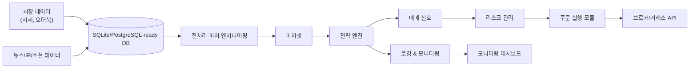

# TripleA - 자동화 퀀트 모니터링 시스템

매일 **08:30**에 주요 경제지표를 수집·분석하고, **기술적 지표 기반 매매 신호**를 생성하여 **텔레그램**으로 자동 전송하는 통합 투자 모니터링 파이프라인입니다.

## 📋 시스템 개요

| 항목 | 내용 |
|------|------|
| 전송 시각 | 매일 08:30 (Asia/Seoul) |
| 데이터 소스 | 한국은행 ECOS, KOSIS, KRX, FRED, Yahoo Finance, KIS OpenAPI, Naver 뉴스, KIPRIS |
| 저장소 | SQLite (WAL 모드) |
| 스케줄러 | APScheduler |
| 전송 채널 | 텔레그램 봇 |
| 대시보드 | Streamlit (`PYTHONPATH=.. streamlit run ../quant_trading_system/monitoring/dashboard.py`) |
| 테스트 | pytest — 105개 통과 |

### 🏗️ 아키텍처



핵심 코드는 `quant_trading_system/` 패키지에 기능별로 분리되어 있습니다.

| 디렉터리/파일 | 역할 |
|---|---|
| `quant_trading_system/data/` | ECOS/FRED/Yahoo/FMP/SEC/뉴스/IR 등 데이터 수집 |
| `quant_trading_system/db/` | DB 스키마, 저장/조회, 주문·신호·원본 응답 기록 |
| `quant_trading_system/features/` | 전처리, 상대강도, 기술적 지표, 피처 파이프라인 |
| `quant_trading_system/strategies/` | 신호 생성 전략과 공통 `Strategy` 인터페이스 |
| `quant_trading_system/risk/` | 주문 수량·포지션 한도 검사 |
| `quant_trading_system/execution/` | 브로커 추상화, paper broker, 주문 실행 |
| `quant_trading_system/monitoring/` | 텔레그램 리포트, 품질 모니터링, 차트, 대시보드, 스케줄러 |
| `quant_trading_system/agents/` | Gemini/LLM 기반 IR 요약 보조 |
| `quant_trading_system/config/` | `indicators.yaml`, `economic_events.yaml` |
| `config.yaml` | 비밀값이 아닌 파이프라인/리스크/실행 설정 |
| `economic_data_pipeline/` | `.env`, SQLite DB, 로그, 실행 스크립트 등 운영 런타임 |

### 수집 지표

<details>
<summary>한국 지표 (ECOS · KOSIS · Yahoo)</summary>

| 지표 | 출처 | 주기 | 상태 |
|------|------|------|------|
| 소비자물가지수 (CPI) | 한국은행 ECOS | 월간 | ✅ |
| 생산자물가지수 (PPI) | 한국은행 ECOS | 월간 | ✅ |
| 원/달러 환율 | 한국은행 ECOS | 일간 | ✅ |
| 기준금리 | 한국은행 ECOS | 수시 | ✅ |
| 두바이유 | 한국은행 ECOS | 일간 | ✅ |
| 코스피 지수 | 한국은행 ECOS | 매일 | ✅ |
| 코스닥 지수 | 한국은행 ECOS | 매일 | ✅ |
| 국고채 수익률(3년) | 한국은행 ECOS | 매일 | ✅ |
| 경제성장률(전기比) | 한국은행 ECOS | 분기 | ✅ |
| 소비자심리지수 | 한국은행 ECOS | 월간 | ✅ |
| 실업률 | 한국은행 ECOS | 월간 | ✅ |
| 금 가격 | Yahoo Finance | 일간 | ✅ |

</details>

<details>
<summary>미국 지표 (FRED · Yahoo)</summary>

| 지표 | 출처 | 주기 | 상태 |
|------|------|------|------|
| WTI 국제유가 | Yahoo Finance / FRED | 일간 | ✅ |
| 미국 CPI | FRED | 월간 | ✅ |
| 미국 기준금리 | FRED | 월간 | ✅ |
| 미국 10년물 국채 (US10Y) | Yahoo / FRED | 일간 | ✅ |
| 달러 인덱스 (DXY) | Yahoo Finance | 일간 | ✅ |
| S&P 500 ETF (SPY) | Yahoo Finance | 일간 | ✅ |
| 반도체 ETF (SMH) | Yahoo Finance | 일간 | ✅ |
| Hyperscaler CapEx | FMP | 분기 | ✅ |

</details>

> **참고**: ECOS `StatisticSearch` API는 불안정하여 `KeyStatisticList` API를 대신 사용합니다 (더 빠르고 안정적).

---

## 🚀 실행 방법

### 1. 사전 준비

#### Python 환경 (3.9 이상 필요)

```bash
# Python 버전 확인
python3 --version

# 프로젝트 디렉토리로 이동
cd economic_data_pipeline

# 가상환경 생성 및 활성화
python3 -m venv .venv
source .venv/bin/activate          # macOS / Linux
# .venv\Scripts\activate           # Windows

# 의존성 설치
pip install -r requirements.txt
```

#### (선택) macOS 한글 폰트는 기본 내장(AppleGothic)이므로 별도 설치 불필요
#### Ubuntu 서버 배포 시 한글 폰트 설치

```bash
sudo apt-get update && sudo apt-get install -y fonts-nanum
fc-cache -fv
```

---

### 2. API 키 설정

`.env.example`을 복사하여 `.env` 파일을 만들고 실제 키를 입력합니다.

```bash
cp .env.example .env
```

`.env` 파일을 열어 다음 항목을 수정하세요:

```dotenv
ECOS_API_KEY=발급받은_ECOS_키
FRED_API_KEY=발급받은_FRED_키
TELEGRAM_BOT_TOKEN=텔레그램_봇_토큰
TELEGRAM_CHAT_ID=수신할_채팅_ID
KIS_APP_KEY=한국투자증권_앱키         # OHLCV 조회용
KIS_APP_SECRET=한국투자증권_시크릿
KIS_ISDEMO=false                      # 모의투자: true
```

#### 필수 API 키 발급처

| API | 발급 URL | 비고 |
|-----|----------|------|
| 한국은행 ECOS | https://ecos.bok.or.kr/api/ | 회원가입 후 발급 (무료) |
| FRED | https://fred.stlouisfed.org/docs/api/ | 이메일 인증 후 발급 (무료) |
| KIS OpenAPI | https://apiportal.koreainvestment.com | 증권계좌 필요 |
| Naver 뉴스 | https://developers.naver.com | 애플리케이션 등록 (선택) |
| KIPRIS | https://plus.kipris.or.kr | 특허청 회원가입 (선택) |

#### 텔레그램 봇 & 채팅 ID 얻는 방법

```
1. Telegram 앱에서 @BotFather 검색
2. /newbot 명령으로 봇 생성
3. 발급된 토큰을 TELEGRAM_BOT_TOKEN에 입력
4. 텔레그램에서 @bum_triple_a_bot 을 검색하고 /start 전송
5. 아래 URL로 chat_id 자동 확인:
   https://api.telegram.org/bot<토큰>/getUpdates
   → result[0].message.chat.id 값을 TELEGRAM_CHAT_ID에 입력
```

> **자동 발견**: TELEGRAM_CHAT_ID가 비어 있어도 봇에 /start를 보내면 프로그램이 자동으로 chat_id를 발견합니다.

---

### 3. 즉시 실행 (수동 1회)

```bash
cd economic_data_pipeline
python -m quant_trading_system.main
```

수집 → DB 저장 → 요약 → 텔레그램 전송이 순서대로 실행됩니다.

---

### 4. 스케줄러 실행 (매일 자동화)

```bash
cd economic_data_pipeline
python -m quant_trading_system.monitoring.scheduler
```

스케줄표:

| 시각 | 작업 |
|------|------|
| 08:00 | 데이터 수집 및 DB 저장 |
| 08:20 | 요약 지표 산출 및 차트 생성 |
| 08:30 | 텔레그램 리포트 전송 |

> 스케줄러는 포그라운드에서 계속 실행됩니다. 백그라운드 실행을 원한다면 `nohup` 또는 `systemd`를 사용하세요.

---

### 5. 백그라운드 실행 (서버 배포)

#### nohup 방식 (간단)

```bash
nohup python -m quant_trading_system.monitoring.scheduler > scheduler_out.log 2>&1 &
echo $!   # PID 확인
```

종료:

```bash
kill <PID>
```

#### systemd 서비스 등록 (Ubuntu 권장)

`/etc/systemd/system/economic-pipeline.service` 파일 생성:

```ini
[Unit]
Description=Economic Data Pipeline Scheduler
After=network.target

[Service]
Type=simple
User=ubuntu
WorkingDirectory=/home/ubuntu/TripleA/economic_data_pipeline
Environment=PYTHONPATH=/home/ubuntu/TripleA
ExecStart=/home/ubuntu/TripleA/economic_data_pipeline/.venv/bin/python -m quant_trading_system.monitoring.scheduler
Restart=on-failure
RestartSec=60

[Install]
WantedBy=multi-user.target
```

등록 및 시작:

```bash
sudo systemctl daemon-reload
sudo systemctl enable economic-pipeline
sudo systemctl start economic-pipeline
sudo systemctl status economic-pipeline
```

#### launchd 서비스 등록 (macOS 권장)

`~/Library/LaunchAgents/com.economic-pipeline.plist` 파일 생성:

```xml
<?xml version="1.0" encoding="UTF-8"?>
<!DOCTYPE plist PUBLIC "-//Apple//DTD PLIST 1.0//EN" "http://www.apple.com/DTDs/PropertyList-1.0.dtd">
<plist version="1.0">
<dict>
    <key>Label</key>
    <string>com.economic-pipeline</string>
    <key>ProgramArguments</key>
    <array>
        <string>/Users/bumsangkim/Dev/TripleA/economic_data_pipeline/.venv/bin/python</string>
        <string>-m</string>
        <string>quant_trading_system.monitoring.scheduler</string>
    </array>
    <key>WorkingDirectory</key>
    <string>/Users/bumsangkim/Dev/TripleA/economic_data_pipeline</string>
    <key>RunAtLoad</key>
    <true/>
    <key>KeepAlive</key>
    <true/>
    <key>StandardOutPath</key>
    <string>/Users/bumsangkim/Dev/TripleA/economic_data_pipeline/pipeline.log</string>
    <key>StandardErrorPath</key>
    <string>/Users/bumsangkim/Dev/TripleA/economic_data_pipeline/pipeline.log</string>
    <key>EnvironmentVariables</key>
    <dict>
        <key>PYTHONPATH</key>
        <string>/Users/bumsangkim/Dev/TripleA</string>
    </dict>
</dict>
</plist>
```

```bash
launchctl load ~/Library/LaunchAgents/com.economic-pipeline.plist
launchctl start com.economic-pipeline
```

---

## 📁 프로젝트 구조

```
TripleA/
├── config.yaml
├── quant_trading_system/
│   ├── agents/          # LLM/Gemini 보조 분석
│   ├── config/          # indicators.yaml, economic_events.yaml, env settings
│   ├── data/            # 외부 API/크롤러 수집
│   ├── db/              # DB schema, persistence, query helpers
│   ├── execution/       # broker client, paper broker, order executor
│   ├── features/        # preprocess, technical indicators, relative strength
│   ├── monitoring/      # Telegram, quality checks, charts, dashboard, scheduler
│   ├── risk/            # position/order risk limits
│   ├── strategies/      # Strategy interface and alpha signals
│   └── main.py          # pipeline orchestration
├── economic_data_pipeline/
│   ├── .env
│   ├── requirements.txt
│   ├── run.sh
│   ├── start_scheduler.sh
│   ├── economic_data.db
│   ├── pipeline.log
│   └── tests/
└── DevelopLog/
```

---

## 📊 텔레그램 메시지 예시

```
📊 오늘의 경제지표 요약 (2026년 05월 12일)

• 소비자물가지수: `119.37 pt(2020=100)` ▲ +0.30%
• 생산자물가지수: `125.24 pt(2020=100)` ▲ +0.50%
• 원/달러 환율: `1,472.40 원` ▲ +0.20%
• 한국 기준금리: `2.50 %` ➡ +0.00%
• 코스피: `7,498.00 pt` ▲ +0.40%
• 코스닥: `1,207.72 pt` ▲ +0.15%
• 실업률: `3.00 %` ▼ -0.10%
• 두바이유: `105.30 USD/bbl` ▼ -0.80%
• 금 가격: `4,719.97 USD/oz` ▲ +0.15%
• WTI 국제유가: `109.76 USD/bbl` ▼ -0.60%
• 미국 CPI: `330.29 index` ▲ +0.20%
• 미국 기준금리: `3.64 %` ➡ +0.00%
• 국고채(3년): `3.598 %` ▼ -0.02%
• 경제성장률(전기比): `1.7 %` N/A
```

이후 차트 이미지(코스피, 환율, CPI, 두바이유, WTI, 금 가격 6개 패널)와 CSV 파일도 함께 전송됩니다.

---

## 🔧 운영 모니터링

### 로그 확인

```bash
tail -f pipeline.log
```

### 매매 신호 조회 (SQLite)

```bash
sqlite3 economic_data.db "SELECT created_at,indicator,signal_type,strategy,confidence FROM signals ORDER BY created_at DESC LIMIT 20;"
```

### 기술적 지표 피처 조회

```bash
sqlite3 economic_data.db "SELECT indicator,rsi14,ma_signal,macd_bias,bb_bandwidth FROM features ORDER BY computed_at DESC LIMIT 10;"
```

### 수집 현황 조회

```bash
sqlite3 economic_data.db "SELECT indicator, date, value FROM indicators ORDER BY date DESC LIMIT 20;"
sqlite3 economic_data.db "SELECT status, COUNT(*) FROM collect_log WHERE run_date=date('now') GROUP BY status;"
```

---

## ⚠️ 신규 API 필요 항목

현재 구조에서 다음 기능을 추가하려면 별도 API 등록 또는 인프라가 필요합니다.

| 기능 | 필요 사항 |
|------|----------|
| **KIS 실제 주문 집행** | 현재 조회 전용. 주문 실행은 증권사 모의투자·실전 계좌 별도 설정 필요 |
| **Upbit 암호화폐 거래** | https://upbit.com/service_center/open_api_guide 별도 등록 필요 |
| **실시간 WebSocket 스트림** | KIS·Upbit 웹소켓 권한 별도 확인 필요 |
| **PostgreSQL 마이그레이션** | 현재 SQLite → 운영 DB 전환 시 서버 필요 |
| **Docker 컨테이너화** | Docker Desktop 설치 + Dockerfile 작성 필요 |

---

## 🛠️ 의존성 패키지

| 패키지 | 용도 |
|--------|------|
| `requests` | HTTP API 호출 |
| `pandas` | 데이터 처리 |
| `numpy` | 수치 연산 |
| `matplotlib` | 차트 생성 |
| `apscheduler` | 스케줄러 |
| `python-dotenv` | 환경변수 관리 |
| `feedparser` | RSS 파싱 |
| `ruptures` | 변화점 탐지 |
| `streamlit` | 대시보드 UI |
| `google-genai` | Gemini AI IR 요약 |
| `beautifulsoup4` | SEC 문서 파싱 |

---

## ⚠️ 주의사항

1. **`.env` 파일은 절대 Git에 커밋하지 마세요.** `.gitignore`에 이미 포함되어 있습니다.
2. `KIS_APP_KEY` / `KIS_APP_SECRET`은 현재 **조회(OHLCV) 전용**으로 사용됩니다. 실제 주문 실행 코드는 포함되어 있지 않습니다.
3. 매매 신호는 **참고용**이며 실제 투자 결정에 직접 사용하지 마세요.
4. ECOS `StatisticSearch` API는 불안정하여 `KeyStatisticList` API를 대신 사용합니다.
5. `TELEGRAM_CHAT_ID`가 없어도 파이프라인은 실행됩니다. 봇에 `/start`를 보내면 자동 발견됩니다.
6. 변화율(▲▼)은 DB에 전일 데이터가 쌓인 2일차부터 표시됩니다.
