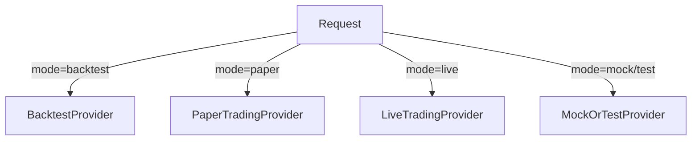

# Executive Summary  
TripleA 대시보드는 **투자 의사결정 지원용 통합 플랫폼**으로, 모의데이터 → 백테스트 → 모의투자 → 실전투자 모드 전환을 지원합니다. 각 모드별 데이터 처리 방식과 허용/금지 동작을 구분하며, **일반계좌(GENERAL), ISA, 연금저축(PENSION_SAVINGS), IRP** 등 계좌 유형별로 별도 정책을 적용합니다. 데이터 소스는 모드별 Provider 인터페이스를 통해 추상화되며, FastAPI 백엔드와 Next.js 프론트엔드 구조를 갖습니다. **MasterPortfolioEngine → (DefensiveCoreEngine, AggressiveAlphaEngine, AccountEngine)** 계층 구조로 자산 배분 및 리밸런싱 로직을 처리하고, SQLite/SQLAlchemy 기반 DB에 저장합니다. 리밸런싱 규칙은 자산군 괴리 계산, 경고/위험 임계값 적용, 리밸런스 금액 산출 공식으로 구성되며, 위험예산(RiskBudget)을 통한 공격·방어형 비중 관리 기능을 포함합니다. 주요 알림(리밸런싱 필요, API 연결 실패 등)은 텔레그램 봇으로 전송하며, 중복 방지 정책을 둡니다. 이 보고서는 위 아키텍처와 모드 흐름, 계좌 정책, 엔진 인터페이스, DB 스키마, API 계약, UI 변경사항, 알림 설계, 구현 로드맵 등을 구체적인 예시와 체크리스트와 함께 상세히 정리합니다.  

## 아키텍처 개요  
TripleA 시스템은 **프론트엔드, 백엔드(API 서비스), 데이터베이스, 외부 데이터 소스**로 구성됩니다.  
- 프론트엔드(Next.js + TypeScript + Tailwind)는 사용자 UI를 제공하며, 모드 선택과 데이터 표시를 담당합니다.  
- 백엔드(FastAPI)는 API 요청을 처리하고, 데이터베이스/외부 API와 연동합니다. 환경 변수(`.env`)를 Pydantic Settings로 관리하여 설정을 로드하며, `@lru_cache`로 캐싱해 반복 로드 비용을 줄입니다【8†L890-L897】.  
- DB(SQLite)에는 계좌·자산·목표·알림·백테스트 이력 등이 저장됩니다.  
- 외부 데이터 소스는 **DataProvider 인터페이스**를 통해 모드에 맞는 공급자를 사용합니다. 모드는 `mock`, `test`, `backtest`, `paper`, `live`로 구분되며, 이를 기반으로 적절한 Provider가 호출됩니다.  

아래는 시스템 구성도 및 모드별 데이터 흐름 예시입니다.

```mermaid
flowchart LR
  subgraph 프론트엔드
    UI[Dashboard UI<br/>(Next.js)] 
    UI -->|API 호출| API
  end
  subgraph 백엔드
    API[FastAPI] 
    API -->|쿼리| DB[(SQLite)]
    API -->|호출| Providers
    subgraph Modes
      Providers[DataProviders]
      Providers --> DB
      Providers --> External[증권사/Macro APIs]
    end
  end
  subgraph 외부 데이터
    External
  end
```

모드별 라우팅은 API 레벨에서 처리됩니다. `/api/*?mode=...` 쿼리 파라미터 또는 HTTP 헤더로 모드를 지정하며, `ProviderRouter`가 해당 모드에 맞는 DataProvider를 선택합니다. 예를 들어:



## 모드 정의 및 동작  
각 모드는 지원 범위와 사용 가능 기능이 다릅니다.

- **Mock 모드**: 화면/로직 개발용, 고정 mock 데이터만 사용. DB 읽기만 가능, 쓰기/주문 금지.  
- **Test 모드**: 테스트 데이터 사용, 내부 테스트 DB나 샘플 CSV 기반. 주문 금지, 조회/계산 동작만.  
- **Backtest 모드**: 과거 시뮬레이션. 과거 시세 및 매크로 데이터 이용, 기간 선택 후 룰 기반 리밸런싱 수행. 계산 결과만 저장, 실주문 없음.  
- **Paper 모드(모의투자)**: 증권사 모의투자 계좌 사용. 주문 조회/유효성 확인 가능, 실제 “모의” 주문 실행(거절 가능). 실투자 금지.  
- **Live 모드(실전투자)**: 실제 계좌 사용. 초기에 조회 전용 모드로 출발(주문 기능 비활성화). 후속 단계에서 **주문 후보 생성 → 수동 승인 주문** 기능 추가.  
  
|모드         |데이터출처           |주문동작    |DB쓰기    |
|:-----------:|:------------------:|:----------:|:-------:|
|Mock         |하드코딩 Mock        |금지        |조회전용 |
|Test         |테스트 DB/샘플 CSV    |금지        |조회전용 |
|Backtest     |과거 시세/매크로 데이터|금지        |결과 저장|
|Paper        |모의투자 계좌 API     |모의주문 가능|사용자데이터 저장|
|Live         |실제 계좌 API        |수동승인 주문|사용자데이터 저장|

모드별 허용/금지 행동 예시:  
- Mock/Test: DB 연결만 허용(변경금지), API 호출 금지, 주문 금지.  
- Backtest: 백테스트 이력 테이블 쓰기, 리밸런스 결과 저장, 단 실제 계좌 호출 및 주문 금지.  
- Paper: 모의투자 API 조회/주문 호출 가능, `orders` 테이블에 모의주문 기록, 실데이터 전용.  
- Live: 계좌 조회 가능, 주문 후보 생성 가능(실제 주문은 “검토 후 수동 실행”으로 제한).  

## 계좌 타입 및 역할  
계좌 유형에 따라 투자 목적과 제약이 다릅니다.  
- **GENERAL(일반계좌)**: 유동성·단기 운용 계좌. 매도/매수 자유, 공격적 투자 가능. (계좌역할: `SATELLITE` 또는 `CORE`)  
- **ISA**: 절세 목적 중기 계좌. 납입 한도 있음. 매매 자주 자제, 신규 납입금 활용 우선. (계좌역할: `TAX_ADVANTAGED`)  
- **PENSION_SAVINGS(연금저축)**: 노후 자산. 장기+보수적 운용, 위험자산 과다노출 제한. (계좌역할: `RETIREMENT`)  
- **IRP**: 퇴직/노후 자산. 출금/매도 제약, 안전자산 비중 유지. (계좌역할: `RETIREMENT`)  

각 계좌별 주요 정책 차이:  
- **입금/출금**: ISA·연금·IRP는 입금 상한(연간) 있음. 연금/IRP는 출금 원칙적으로 불가(정책에 따라 예외).  
- **허용 상품**: ISA는 장내펀드·국내주식 위주, IRP는 안전자산(국공채·TDF) 제약, 일반계좌는 모든 상품.  
- **리밸런싱 우선순위**: IRP·연금계좌는 안전성 우선(방어형 운용), 일반계좌/ISA는 공격적 기회 활용(병목·모멘텀 운용).  
- **세제 효과**: ISA/연금은 세제혜택 계좌로 장기투자 유도.  
  
예를 들어, **IRP**에서 위험자산 비중이 높으면 “안전자산 확보 경고”, **일반계좌**에서는 “리스크 감수 범위 내”로 판단할 수 있습니다. 계좌별 정책은 `account_policies` 테이블이나 설정 파일로 관리합니다.

## 엔진 설계  

### MasterPortfolioEngine  
- **역할**: 전체 포트폴리오 목표(전략군별) 대비 현황을 평가하고, 각 하위 엔진(Defensive/Aggressive/AccountEngine) 호출 후 결과를 통합합니다.  
- **입력**: `{ accounts: AccountSnapshot[], targets: PortfolioTarget[], context: {mode, date, riskBudget} }`  
- **출력**: `MasterResult` (전체 및 계좌별 리밸런스 제안, 경고/알림)  
- **처리 순서**:  
  1. 활성 계좌 필터링(includeInRebalancing) 및 `AccountSnapshot` 수집.  
  2. 전체 자산합, 전체 현금·주식·채권 비중 계산.  
  3. 전략군(공격/방어/유동성) 목표 대비 괴리 계산.  
  4. `RiskBudgetEngine`로 위험예산 제약 확인(방어형/공격형 최대·최소 비중).  
  5. `DefensiveCoreEngine` 호출: 연금·IRP 계좌와 핵심 자산 분석.  
  6. `AggressiveAlphaEngine` 호출: 일반계좌·ISA 계좌 공격 자산 분석.  
  7. 각 결과 병합(충돌 제거, 우선순위 적용).  
  8. 최종 리밸런스 제안 및 알림 생성.  

### DefensiveCoreEngine  
- **역할**: **방어형/핵심 자산** 운용 계좌의 리밸런싱 검사. (예: 개인연금, IRP, MSCI, 미국채, 금, 현금 등)  
- **주요 정책**:  
  - *안전자산 비중 유지*: 현금·채권 최소 비중 목표를 지킴.  
  - *리밸런싱 주기 제한*: 월 1회 이하 등으로 잦은 매매 방지.  
  - *새로운 입금 활용*: 계좌 입금 한도 내에서는 부족 자산군에 우선 사용.  
  - *과도한 위험 제한*: 위험자산 비중 상한 설정.  
- **입력/출력 예시**:  
  - 입력: `{accountType: PENSION_SAVINGS, snapshot: {values}, targets: {...}, context: {...}}`  
  - 출력 예시:  
    ```json
    {
      "accountType": "PENSION_SAVINGS",
      "assetClass": "FOREIGN_STOCK",
      "currentRatio": 0.52,
      "targetRatio": 0.50,
      "deviation": +0.02,
      "action": "HOLD",
      "reason": "허용 범위 내, 리밸런싱 주기 미도래"
    }
    ```  

### AggressiveAlphaEngine  
- **역할**: **공격형/모멘텀 자산** 운용 계좌의 리밸런싱 검사. (예: 일반계좌, ISA 일부, 병목투자 대상 자산)  
- **주요 정책**:  
  - *공격형 위험예산*: 전체 포트폴리오 내 공격형 비중 상한(예: 30%) 설정.  
  - *병목투자 우선*: 주요 버킷(반도체, 인프라 등)에 집중.  
  - *개별 상한*: 종목/섹터별 최대 비중 제한(예: 종목 5–8%).  
  - *현금 충분 여부*: 현금 부족 시 신규 진입 자제.  
- **입력/출력 예시**:  
  - 입력: `{accountType: GENERAL, snapshot: {...}, targets: {...}, context: {...}}`  
  - 출력 예시:  
    ```json
    {
      "accountType": "GENERAL",
      "assetClass": "DOMESTIC_STOCK",
      "currentRatio": 0.40,
      "targetRatio": 0.30,
      "deviation": +0.10,
      "action": "REDUCE",
      "reason": "위험자산 과대, 일부 매도 권장(현금 확보 우선)"
    }
    ```  

### AccountEngine (기본 및 계좌별)  
- **BaseAccountEngine**: `calculateSnapshot`, `calculateDeviation`, `generateRebalancePlan` 인터페이스 정의.  
- **계좌별 구현**:  
  - `GeneralAccountEngine` (일반계좌, 유연 운용)  
  - `ISAAccountEngine` (ISA, 입금 활용 우선)  
  - `PensionSavingsEngine` (연금저축, 장기 안정 지향)  
  - `IRPEngine` (IRP, 최대 안전 자산 지향)  
- **공통 작업**: 계좌별 자산 비중 계산, 목표 대비 괴리 계산, 경고·리밸랜싱 후보 생성.  
- **예시 반환값**: 계좌별로 `{assetClass, currentRatio, targetRatio, deviation, action, reason}` 형태 배열.

## 리밸런싱 룰  

- **괴리 계산**: 계좌/자산군별 현재비중(=자산군가치/계좌총가치)과 목표비중의 차이로 계산.  
- **임계값(Threshold)**: 일반적인 ±3~5% 포인트 사용【13†L263-L271】. 예를 들어, 목표비중 30%라면 25~35%를 벗어나면 리밸런싱 트리거. (ForTraders에 따르면 **±5% 기준**이 자주 추천됨【13†L263-L271】.)  
- **조정 금액 공식**: `조정금액 = (현재비중 − 목표비중) × 전체총자산`.  
- **위험예산(RiskBudget)**: 포트폴리오 전체 위험한계로 전략별 비중 한도 설정. 예: 방어형 자산 최소 비중 60~80%, 공격형 자산 최대 30% 등. 위험예산 엔진이 이 범위 초과 여부를 판단해 공격형 매수/매도를 보류할 수 있습니다. 예를 들어 전체 현금이 목표보다 부족하면 공격형 신규 진입을 제한하고 방어형을 우선 보강합니다.  
- **계좌별/전략별 우선순위**:  
  - *안전자산 충족 우선*: 현금·채권 부족 시 일반계좌에서 확보.  
  - *입금 활용 우선*: ISA·연금 신규 입금은 부족 자산군에 배정.  
  - *세제계좌 우선 활용*: ISA/연금계좌는 절세 혜택 고려하여 주요 목표 자산 보유 유지.  
  - *긴급 조정*: MDD 급등 같은 상황 시 전체 리스크 억제를 우선.  

## 데이터 모델 (DB 스키마)  
주요 테이블 예시:

```sql
-- 사용자 계정 정보
CREATE TABLE accounts (
  id INTEGER PRIMARY KEY,
  name TEXT NOT NULL,
  account_type TEXT NOT NULL,              -- GENERAL, ISA, PENSION_SAVINGS, IRP
  broker TEXT,
  connection_status TEXT DEFAULT 'UNLINKED', -- CONNECTED, UNLINKED, FAIL
  trade_status TEXT DEFAULT 'ORDER_DISABLED', -- ORDER_ENABLED, READ_ONLY,...
  include_in_rebalancing BOOLEAN DEFAULT TRUE,
  data_source TEXT,                        -- API, CSV, MANUAL, MOCK
  last_synced_at DATETIME,
  created_at DATETIME DEFAULT CURRENT_TIMESTAMP
);

-- 계좌 보유 종목/자산
CREATE TABLE holdings (
  id INTEGER PRIMARY KEY,
  account_id INTEGER NOT NULL REFERENCES accounts(id),
  symbol TEXT,
  asset_class TEXT,
  quantity REAL,
  price REAL,
  value REAL,
  strategy_bucket TEXT,                    -- 예: DEFENSIVE_CORE, AGGRESSIVE_ALPHA
  updated_at DATETIME DEFAULT CURRENT_TIMESTAMP
);

-- 수동 입력 또는 API 스냅샷
CREATE TABLE account_snapshots (
  id INTEGER PRIMARY KEY,
  account_id INTEGER NOT NULL REFERENCES accounts(id),
  total_value REAL NOT NULL,
  cash_value REAL DEFAULT 0,
  domestic_stock_value REAL DEFAULT 0,
  foreign_stock_value REAL DEFAULT 0,
  bond_value REAL DEFAULT 0,
  etf_value REAL DEFAULT 0,
  pension_value REAL DEFAULT 0,
  alt_value REAL DEFAULT 0,
  snapshot_at DATETIME NOT NULL,
  created_at DATETIME DEFAULT CURRENT_TIMESTAMP
);

-- 전체 포트폴리오 목표
CREATE TABLE portfolio_targets (
  id INTEGER PRIMARY KEY,
  target_name TEXT,
  asset_class TEXT NOT NULL,
  target_ratio REAL NOT NULL,            -- 예: 국내주식, 0.25
  warning_threshold REAL,
  danger_threshold REAL,
  is_active BOOLEAN DEFAULT 1
);

-- 계좌별 목표 (account_type별 기본 목표 및 개별 계좌)
CREATE TABLE account_targets (
  id INTEGER PRIMARY KEY,
  account_type TEXT NOT NULL,
  account_id INTEGER,                    -- NULL이면 타입별 기본, 있으면 개별 계좌 적용
  asset_class TEXT NOT NULL,
  target_ratio REAL NOT NULL,
  warning_threshold REAL,
  danger_threshold REAL,
  is_active BOOLEAN DEFAULT 1
);

-- 전략군별 목표 할당 (위험예산)
CREATE TABLE engine_allocations (
  id INTEGER PRIMARY KEY,
  strategy_bucket TEXT NOT NULL,         -- DEFENSIVE_CORE, AGGRESSIVE_ALPHA, LIQUIDITY 등
  target_ratio REAL NOT NULL,
  min_ratio REAL,
  max_ratio REAL,
  is_active BOOLEAN DEFAULT 1,
  updated_at DATETIME DEFAULT CURRENT_TIMESTAMP
);

-- 리밸런싱 결과 로그
CREATE TABLE rebalance_results (
  id INTEGER PRIMARY KEY,
  run_id INTEGER,                        -- 실행 식별자
  mode TEXT NOT NULL,                    -- mock/test/backtest/paper/live
  account_id INTEGER,
  account_type TEXT,
  asset_class TEXT,
  current_ratio REAL,
  target_ratio REAL,
  deviation REAL,
  action TEXT,                           -- HOLD/INCREASE/REDUCE/CHECK_RULE 등
  amount REAL,
  reason TEXT,
  created_at DATETIME DEFAULT CURRENT_TIMESTAMP
);

-- 백테스트 실행 이력
CREATE TABLE backtest_runs (
  id INTEGER PRIMARY KEY,
  name TEXT,
  start_date DATE,
  end_date DATE,
  initial_capital REAL,
  rebalance_frequency TEXT,
  status TEXT,
  total_return REAL,
  annual_return REAL,
  max_drawdown REAL,
  volatility REAL,
  created_at DATETIME DEFAULT CURRENT_TIMESTAMP
);

-- 알림/통보 채널 설정
CREATE TABLE notification_channels (
  id INTEGER PRIMARY KEY,
  channel_type TEXT NOT NULL,           -- e.g. TELEGRAM
  channel_name TEXT,
  config JSON,
  is_enabled BOOLEAN DEFAULT 1,
  created_at DATETIME DEFAULT CURRENT_TIMESTAMP
);

-- 전송된 알림 로그 (중복 방지에 사용)
CREATE TABLE notification_logs (
  id INTEGER PRIMARY KEY,
  channel_type TEXT NOT NULL,
  alert_type TEXT,
  message TEXT,
  dedup_key TEXT,
  status TEXT,
  sent_at DATETIME,
  error_message TEXT,
  created_at DATETIME DEFAULT CURRENT_TIMESTAMP
);
```

- **Upsert**: 각 테이블에 중복 저장 방지를 위해 SQLite `INSERT ... ON CONFLICT ... DO UPDATE` 문을 사용합니다【6†L200-L208】. 예: 
  ```sql
  INSERT INTO accounts(id,name) VALUES(1,'계좌A')
    ON CONFLICT(id) DO UPDATE SET name=excluded.name;
  ```

## API 계약  
모드 분기, RESTful 엔드포인트 및 JSON 형식 예시:

- **GET /api/dashboard/summary?mode={mode}**  
  전체 대시보드 요약.  
  - 응답 예시:
    ```json
    {
      "mode": "paper",
      "totalAsset": 100000000,
      "assetAllocation": {
        "domesticStock": 0.25,
        "foreignStock": 0.35,
        "bond": 0.20,
        "cash": 0.15,
        "alt": 0.05
      },
      "deviationSummary": {...}
    }
    ```
- **GET /api/accounts?mode={mode}**  
  계좌 목록 조회.  
  - 응답 예시:
    ```json
    [
      {
        "id": 1,
        "name": "종합계좌",
        "type": "GENERAL",
        "totalValue": 50000000,
        "assetAllocation": {...},
        "apiStatus": "CONNECTED",
        "lastUpdated": "2026-05-21T09:00:00Z"
      },
      ...
    ]
    ```
- **GET /api/holdings?mode={mode}&accountId={id}**  
  계좌별 보유종목 조회.  
- **GET /api/targets?mode={mode}**  
  전체 및 계좌별 목표 비중 조회.  
- **GET /api/rebalancing/suggestions?mode={mode}**  
  리밸런싱 제안 조회. 결과 예시:
  ```json
  {
    "accountResults": [...], 
    "overallResult": {
      "riskStatus": "warning",
      "cashShortage": true
    }
  }
  ```
- **POST /api/backtests/run**  
  백테스트 실행. 요청 예시:
  ```json
  {
    "name": "Test1",
    "startDate": "2020-01-01",
    "endDate": "2024-12-31",
    "initialCapital": 100000000,
    "rebalanceFrequency": "monthly",
    "targets": [
      {"assetClass":"DOMESTIC_STOCK","targetRatio":0.25},
      {"assetClass":"FOREIGN_STOCK","targetRatio":0.35},
      {"assetClass":"BOND","targetRatio":0.20},
      {"assetClass":"CASH","targetRatio":0.20}
    ]
  }
  ```
- **POST /api/orders/draft**  
  주문 후보 생성. 요청 예시:
  ```json
  {
    "mode": "paper",
    "source": "rebalancing",
    "maxOrderAmount": 1000000
  }
  ```
- **POST /api/orders/execute**  
  주문 실행(실전모드 시 확인 필수). 요청 예시:
  ```json
  {
    "mode": "live",
    "orderDraftId": 123,
    "confirmText": "실전 주문을 확인합니다"
  }
  ```
- **PATCH /api/accounts/{id}/connection-status**  
  계좌 API 연동 상태 변경.  
- **PATCH /api/accounts/{id}/rebalancing-inclusion**  
  리밸런싱 포함 여부 토글.  
- **POST /api/accounts/{id}/manual-snapshot**  
  미연동 계좌 수동 데이터 입력. JSON 예:
  ```json
  {
    "totalValue": 21846000,
    "cashValue": 1000000,
    "domesticStockValue": 7000000,
    "foreignStockValue": 5000000,
    "bondValue": 3000000,
    "etfValue": 2000000,
    "snapshotAt": "2026-05-22T09:00:00+09:00"
  }
  ```

각 API는 FastAPI OpenAPI 문서로 자동 생성할 수 있습니다. 환경 변수로 설정된 `API_TOKEN` 등의 인증 헤더를 요구할 수 있습니다. FastAPI 권장 설정 방법은 Settings 클래스(`@lru_cache`)와 Pydantic 모델을 활용합니다【8†L890-L897】.

## 프론트엔드 변경사항  
- **ModeSelector 컴포넌트**: 헤더에 드롭다운 형태로 모드 표시(`Mock`, `Backtest`, `Paper`, `Live`). Live 모드는 색상 강조(빨강 경고).  
- **Sidebar/Header**: 로그인 사용자 상태, 모드 표시, 알림 아이콘 추가.  
- **계좌 현황 패널**:  
  - 계좌 테이블에 `API 연동`(`✓`/`✗`)과 `리밸런싱 포함(checkbox)` 컬럼 추가.  
  - `데이터 기준` 컬럼: “API”/“수동입력” 표시.  
  - 계좌그룹: 탭 또는 필터로 `전체 / 일반 / ISA / 연금 / IRP` 선택.  
- **목표 및 괴리 패널**: `전체 / 계좌별` 탭 추가. 탭별로 해당 목표 비중과 괴리 표시.  
- **리밸런싱 패널**:  
  - 좌측에 `전략별` 탭(`방어형(Core)`, `공격형(Alpha)`) 추가.  
  - 우측 상세에 계좌별 결과 표시.  
  - 제안 컬럼에 “행동(Action)“ 및 “사유(Reason)”. 예시: `REDUCE`, `INCREASE`, `HOLD` 등.  
- **미연동 계좌**: 계좌 목록에서 미연동 계좌는 아이콘/태그(`수동`) 표시. 체크박스는 “리밸런싱 포함” 여부용으로 사용.  
- **수동 스냅샷 모달**: 미연동 계좌의 [입력]버튼 클릭 시 뜨는 모달. 자산군별 금액 입력 필드, 저장 버튼.  
- **알림/이상탐지 패널**: 리밸런싱 경고, 데이터 신선도 경고, API 오류 등 알림 목록.  
- **차트 패널**: 백테스트 결과 시 `자산변동곡선`, `Drawdown` 차트. (Backtest 모드에서만 보이도록).  
- **포매터**: 백틱 문자 강조, 표기법(Percent, 콤마) 등 UI에서 알기 쉽게.  

## 알림 설계  
- **Alert 엔티티**: `alerts` 테이블에 `{type, level, message, relatedAccountId, createdAt}` 저장. 예: `리밸런싱 필요(위험)`, `데이터 동기화 실패`.  
- **텔레그램 알림**:  
  - **TelegramNotifier**: Bot API 사용. HTTPS `https://api.telegram.org/bot<token>/sendMessage` 형태로 호출【11†L214-L222】.  
  - **전송 조건**: 위험(`danger`) 또는 중요한 경고 이벤트만 발송. 예: `현금 부족(danger)`, `계좌 연동 실패`, `실전주문 후보 생성`. 단순 정보(`info`)나 반복된 알림은 생략.  
  - **중복 방지(Dedup)**: `notification_logs`에 최근 전송된 메시지의 dedup_key를 기록. 동일 키의 메시지는 하루 1회로 제한. 예: `"REBALANCE_DANGER_2026-05-22"`.  
  - **예시 메시지**:  
    ```
    [TripleA 리밸런스 경고]
    모드: 모의투자
    전체 괴리: 주식 +4.2%, 현금 -6.9%
    권장: 주식 비중 축소, 현금 비중 보강
    ※ ISA 계좌는 API 미연동(수동입력 기준, 5일 전)
    ```  
  - 메시지 발송은 `NotificationService`에서 조건 검사 후 `TelegramNotifier.send()` 호출. 응답 JSON `{ "ok": true }` 형태이며, 성공 시 로그 저장합니다【11†L214-L222】.

## 데이터 소스 추상화  
모드별 데이터 제공자(DataProvider)를 구현하여 확장성을 확보합니다. 공통 인터페이스 예:

```ts
interface PortfolioProvider {
  getAccounts(): Promise<Account[]>;
  getHoldings(accountId: number): Promise<Holding[]>;
  getTargets(): Promise<Target[]>;
  executeOrders?(): Promise<OrderResult>; 
}
```

- **MockProvider**: 정적 JSON 사용.  
- **TestProvider**: 테스트 DB/CSV 사용.  
- **BacktestProvider**: 과거 시세 DB 조회, 시뮬레이션 엔진 연결.  
- **PaperTradingProvider**: 증권사 모의 API(REST/SOAP) 호출.  
- **LiveTradingProvider**: 실제 계좌 API 연동.  

모드 전환 시 `ProviderRouter`가 해당 객체를 선택합니다. 예:  
```ts
function getProvider(mode: TradingMode): PortfolioProvider {
  switch(mode) {
    case 'mock': return new MockProvider();
    case 'backtest': return new BacktestProvider();
    case 'paper': return new PaperTradingProvider();
    case 'live': return new LiveTradingProvider();
    default: return new TestProvider();
  }
}
```

## 구현 우선순위 및 로드맵  
우선순위를 **P0/P1/P2**로 구분하고, Sprint마다 완료 기준(체크리스트)를 둡니다.

- **P0(필수)**: 모드 시스템, DB 중복방지, Mock UI, 리밸런싱 계산.  
- **P1(다음)**: API/DB 연동, 알림, 백테스트 구현, 계좌별 엔진.  
- **P2(후순위)**: 증권사 API, AI 리포트, 모바일 대응, Docker 배포 등.

**Sprint 계획 예시 (8주 기준)**:

|주차|목표|주요 작업|완료기준 (체크리스트)|
|---|---|---|---|
|1주차|Mock UI 기반 대시보드|Next.js 초기설정, MockProvider 구현, DashboardLayout|Mock 모드에서 대시보드 UI 출력 성공 (값은 모두 mock)|
|2주차|리밸런싱 엔진 기초|`calculateDeviation()`, `generateRebalancePlan()` 구현, 목표/괴리 계산|변수 변경 시 리밸런싱 결과 변경(기능 정상)|
|3주차|FastAPI & DB 기초|FastAPI 프로젝트 설정, SQLite 테이블 생성, `/api/dashboard/summary` 구현|실제 DB 연동 후 모드=test에서 DashboardSummary 조회 성공|
|4주차|데이터 연동 & 테스트 모드|accounts/holdings 테이블, CSV 업로드 기능, Provider추상화|test 모드에서 샘플 CSV 데이터로 대시보드 표시|
|5주차|Backtest 기능|백테스트 API 및 UI 구현, 백테스트 이력 저장|기간선택 후 백테스트 실행, 결과 차트 표시|
|6주차|Paper Trading 모드|모의투자 API 연동 (예시 기능), 계좌 조회, 모의주문|모의계좌 잔고 조회, 모의주문 결과 확인|
|7주차|Live Trading (조회만)|실계좌 조회 연동, 리밸런싱 점검|실계좌 잔고 조회, 리밸런싱 추천 생성 (주문 비활성)|
|8주차|테스트 및 문서화|Unit/Integration 테스트, 코드리뷰, README 작성|주요 기능 테스트 커버리지 확보, 문서 갱신 완료|

## 테스트 계획  
- **단위 테스트**: 핵심 함수(목표/괴리 계산, 엔진 로직, 알림 생성) 우선. 계좌별 엔진별 로직 검증. SQLite upsert 쿼리 검증.  
- **통합 테스트**: FastAPI Endpoint 호출, Mock DB/Provider를 이용한 E2E 시나리오. GraphQL/REST API 시뮬레이션.  
- **백테스트 검증**: 간단한 자산배분 예시로 룰 엔진 결과와 기대치 비교. 벤치마크 대비 계산 정확도 확인.  

예시:  
```python
def test_deviation_calculation():
    snapshot = {'domesticStock': 50, 'foreignStock': 30, 'bond': 20}
    targets = {'domesticStock': 0.4, 'foreignStock': 0.3, 'bond': 0.3}
    result = calculateDeviation(snapshot, targets)
    assert result['domesticStock'].deviation == 0.10
```

## 보안/운영 고려사항  
- **.env 및 비밀 관리**: Bot 토큰, DB 경로 등 민감값은 `.env`에 저장하고 Git 비추가. FastAPI Settings 이용【8†L890-L897】.  
- **인증/권한**: JWT 토큰 인증, CORS 설정. API 엔드포인트 보호.  
- **API 연동 오류 대응**: 타임아웃, 예외처리, 재시도 로직. 에러 발생 시 로그 남기기.  
- **DB 백업**: 정기 SQLite 백업 스크립트 또는 주기적 덤프. 중요 데이터는 파일로 보관.  
- **로그 관리**: Python `logging`으로 주요 이벤트(리밸런싱 결과, 주문 실패, 알림 전송) 기록. 로그 파일 회전(RotatingFileHandler) 설정.  
- **알림 보안**: 텔레그램 Bot 토큰은 OS 환경 변수로 관리. NotificationService 내부 로깅 및 예외 처리.  
- **운영 모니터링**: 스케쥴러(launchd/cron) 사용 시 실행 결과 모니터링. 실패 시 관리자 알람(이메일/Slack 등, 텔레그램 포함) 구성.

## 산출물  
- **코드**: GitHub Repository (modules, scripts).  
- **문서**:  
  - `README.md`: 프로젝트 개요, 설치/실행 방법, 주요 컴포넌트 설명.  
  - `.env.example`: 필수 환경변수 예시.  
  - **API 문서**: FastAPI OpenAPI(Swagger) 자동 생성, 필요시 추가 설명.  
  - **DB 스키마 문서**: 위 SQL 정의 정리, 테이블 ERD(선택).  
  - **엔진 설계 문서**: 엔진 클래스 다이어그램 및 함수 설명.  
  - **Postman 컬렉션**: 주요 API 예제 요청/응답.  
- **프론트엔드**: 구현된 컴포넌트 목록, 스타일 가이드.  
- **테스트 리포트**: 테스트 커버리지 및 주요 케이스 결과.  

이 보고서는 개발자 가이드 역할을 하며, 각 섹션별 **체크리스트와 예시 코드**를 포함해 바로 구현에 활용할 수 있도록 구성했습니다. 위 설계를 바탕으로 TripleA 대시보드의 안정적인 MVP를 구축하고, 이후 기능을 차례로 확대할 수 있습니다. 

**참고 자료:** FastAPI Settings【8†L890-L897】, Telegram Bot API 문서【11†L214-L222】, SQLite Upsert【6†L200-L208】, Rebalancing Threshold 사례【13†L263-L271】.